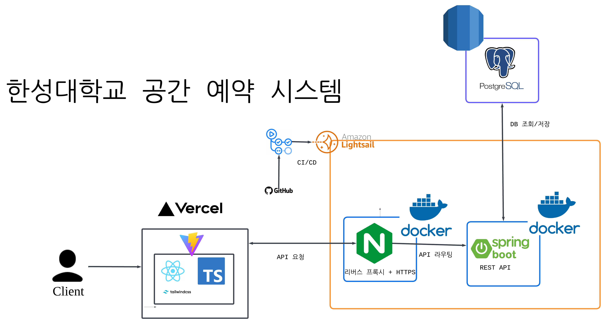
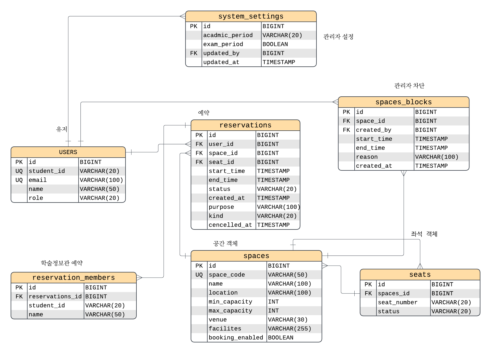

# HSP - 한성대학교 공간 예약 시스템

## 1. 프로젝트 소개

한성대학교의 기존 공간 예약 시스템은 공간을 운영하는 부서마다 예약 방식과 시스템이 분리되어 있어, 학생들이 원하는 공간을 어디에서 예약해야 하는지 찾기 어렵고 예약 가능한 공간과 시간을 한눈에 확인하기 힘들다는 문제가 있었습니다.

HSP는 이러한 문제를 해결하기 위해 시작한 **한성대학교 통합 공간 예약 시스템**입니다.

초기에는 UX/UI 개선에 초점을 맞춰 Firebase 기반의 MVP를 제작했습니다.  
학생이 여러 부서의 예약 시스템을 직접 찾아다니는 대신, **하나의 서비스에서 교내 예약 가능 공간을 탐색하고 예약할 수 있도록 사용자 경험을 통합**했습니다.

사용자에게는 하나의 통합된 예약 서비스를 제공하지만, 예약 정보는 각 공간을 담당하는 부서에 전달되도록 설계하여 기존 학교의 운영 구조를 유지하면서도 학생 입장에서는 하나의 시스템처럼 사용할 수 있도록 구성했습니다.

이후 MVP를 실제 서비스 수준으로 발전시키기 위해 시스템 구조를 재설계했습니다.

Firebase 중심으로 구성되어 있던 기존 데이터 구조를 관계형 데이터베이스 기반으로 변경하여 공간, 예약, 사용자, 관리 부서 등의 관계를 명확하게 관리할 수 있도록 개선했습니다.

또한 Firebase 중심의 서버리스 구조에서 벗어나 **Spring Boot, PostgreSQL, AWS Cloud를 기반으로 백엔드 인프라를 재구성**하여 향후 한성대학교의 기존 시스템 및 서버와 연동할 수 있도록 확장성을 고려해 설계하고 있습니다.

단순한 프로토타입에서 끝나는 것이 아니라, 실제 학교 환경에서 사용할 수 있는 시스템을 목표로 프로젝트를 발전시키고 있습니다.

## 2. 주요 기능

### 통합 공간 예약

사용자는 HSP에 로그인한 뒤 하나의 웹 서비스에서 한성대학교 내 예약 가능한 공간을 확인하고 예약할 수 있습니다.

공간을 담당하는 부서가 서로 다르더라도 사용자는 별도의 예약 시스템을 찾아갈 필요 없이 동일한 인터페이스에서 공간을 검색하고 예약할 수 있습니다.

### 예약 가능 시간 확인

각 공간의 예약 현황과 사용 가능한 시간을 확인하여 원하는 시간대의 공간을 선택할 수 있습니다.

### 부서별 관리자 시스템

각 공간을 담당하는 부서별로 관리자 계정을 구성할 수 있으며, 관리자 대시보드를 통해 해당 부서가 관리하는 공간과 예약 정보를 확인할 수 있습니다.

사용자에게는 하나의 통합 예약 시스템을 제공하면서도, 관리 측에서는 기존의 부서별 공간 관리 체계를 유지할 수 있도록 설계했습니다.
## 3. 서비스 화면

React 프론트엔드를 `frontend/`에 구현했습니다. [실행·구조·검증 안내](frontend/README.md),
[Vercel 배포 설정](docs/vercel-deployment.md), [운영시간·시험기간 API](docs/operating-policy.md)를 참고하세요.

```sh
cd frontend
npm ci
npm run dev
```

기존 `.env`는 유지합니다. 새 환경에서만 `frontend/.env.example`을 `.env`로 복사합니다.
개발 주소는 http://localhost:5173 입니다.

## 4. 시스템 아키텍처
실제 학교 환경에서의 확장성과 기존 시스템과의 연동 가능성을 고려하여
Spring Boot, PostgreSQL, AWS 기반으로 구성했습니다.

<p align="center">
  
</p>
### Architecture

- **Frontend**: 사용자 및 관리자가 공간 예약 서비스를 이용하는 웹 인터페이스
- **Backend**: Spring Boot 기반 REST API 서버
- **Database**: PostgreSQL을 통한 사용자, 공간, 예약 데이터 관리
- **Cloud**: 프론트엔드는 Vercel 배포 구성, 백엔드는 외부 HTTPS 서버/Docker 운영
## 5. 기술 스택

| 분야 | 기술 | 사용 목적 |
|---|---|---|
| Frontend | React | 사용자 및 관리자 웹 인터페이스 구현 |
| Frontend | TypeScript | 타입 안정성을 높이고 유지보수성을 개선 |
| Build Tool | Vite | 빠른 개발 서버 및 프론트엔드 빌드 환경 구성 |
| Styling | Tailwind CSS | 빠르고 일관된 UI 스타일링 |
| Backend | Spring Boot | REST API 및 비즈니스 로직 구현 |
| Database | PostgreSQL | 사용자, 공간, 예약 등 관계형 데이터 관리 |
| Infrastructure | AWS | 실제 서비스 운영을 고려한 클라우드 인프라 구성 |
| Container | Docker | 개발 환경 및 데이터베이스 실행 환경 통일 |

### Frontend
- **React**
  - 사용자 및 관리자 화면을 컴포넌트 기반으로 구현
  - 공간 조회, 예약, 관리자 대시보드 등의 UI 구성

- **TypeScript**
  - 컴포넌트와 API 데이터의 타입을 명확하게 정의
  - 런타임 오류를 줄이고 코드 유지보수성을 향상

- **Vite**
  - React + TypeScript 개발 환경 구성
  - 빠른 개발 서버와 HMR을 활용해 개발 생산성 향상
  - 프로덕션 배포를 위한 프론트엔드 빌드 수행

- **Tailwind CSS**
  - 반복적인 CSS 작성을 줄이고 빠르게 UI 구성
  - 서비스 전체에서 일관된 UI 스타일 유지

### Backend
- **Spring Boot**
  - 공간 조회 및 예약 API 구현
  - 사용자 인증 및 권한 관리
  - 부서별 관리자 기능 구현

### Database
- **PostgreSQL**
  - 사용자, 공간, 부서, 예약 간 관계를 관계형 데이터베이스로 관리
  - Firebase 기반 MVP의 데이터 구조를 관계형 구조로 재설계

### Infrastructure
- **AWS**
  - 실제 학교 도입을 고려한 서버 환경 구성
  - 향후 한성대학교 내부 시스템과의 연동 및 확장을 고려한 구조 설계

- **Docker**
  - PostgreSQL 등 개발 환경을 컨테이너화
  - 개발자마다 동일한 실행 환경을 사용할 수 있도록 구성
## 6. 데이터베이스 구조
HSP의 데이터베이스는 사용자, 공간, 좌석, 예약 정보를 중심으로 구성했습니다.

<p align="center">
  
</p>
### 주요 테이블

- **users**: 사용자 및 관리자 계정 정보
- **spaces**: 예약 가능한 공간 정보
- **reservations**: 공간 예약 정보
- **seats**: 공간 내 좌석 및 운영 상태
- **reservation_members**: 예약 참여자의 학번/이름
- **space_blocks**: 관리자 시간 차단
- **system_settings**: 학기/시험 기간 설정 (현재 데이터와 구체적 예약 규칙 없음)

V2에서 로컬 인증용 `user_credentials`, 담당 공간용 `admin_space_permissions`,
차단 해제용 `space_blocks.cancelled_at`을 추가했습니다.
V3는 `space_operating_policies`, `space_operating_hours`로 공간별 운영시간과 시험기간 예외를 관리합니다.
기존 데이터와 전역 `system_settings`는 보존합니다. 부서 테이블과 예약 승인 상태는 아직 없습니다.

## 7. API

Java 21 / Spring Boot 4.1.1 기반 REST API입니다. Entity 대신 record DTO를 반환합니다.
Swagger: **http://localhost:8080/swagger-ui/index.html**
OpenAPI JSON: **http://localhost:8080/v3/api-docs**

### API 목록

| Method | Endpoint | 설명 |
|---|---|---|
| GET | `/api/auth/csrf` | CSRF 토큰 조회 |
| POST | `/api/auth/login` | 학번/비밀번호 로그인 |
| POST | `/api/auth/logout` | 세션 로그아웃 |
| GET | `/api/auth/me` | 현재 사용자 |
| GET | `/api/spaces` | 공간 목록/필터 |
| GET | `/api/spaces/{spaceId}` | 공간 상세 |
| GET | `/api/spaces/{spaceId}/availability` | 요청 구간의 비점유 시간 |
| GET | `/api/spaces/{spaceId}/seats` | 좌석 목록/운영 상태 |
| GET | `/api/spaces/{spaceId}/policy` | 공간 운영시간·시험기간 정책 |
| PUT | `/api/admin/spaces/{spaceId}/policy` | 담당 공간 운영 정책 전체 저장 |
| POST | `/api/reservations` | 예약 생성 |
| GET | `/api/reservations` | 본인의 예약 목록 |
| GET | `/api/reservations/{reservationId}` | 본인의 예약 상세 |
| DELETE | `/api/reservations/{reservationId}` | 본인의 예약 취소 (행 보존) |
| GET | `/api/admin/spaces` | 담당 공간 목록 |
| POST | `/api/admin/spaces` | 공간 등록 및 등록자에게 해당 공간 권한 부여 |
| PATCH | `/api/admin/spaces/{spaceId}` | 담당 공간 수정 |
| GET | `/api/admin/reservations` | 담당 공간 예약 목록 (`spaceId` 선택 필터) |
| GET | `/api/admin/reservations/{reservationId}` | 담당 공간 예약 상세 |
| GET | `/api/admin/spaces/{spaceId}/blocks` | 해제되지 않은 시간 차단 목록 |
| POST | `/api/admin/spaces/{spaceId}/blocks` | 시간 차단 생성 |
| DELETE | `/api/admin/space-blocks/{blockId}` | 차단 해제 (행 보존) |

공간 조회는 공개이며 예약/본인 정보는 인증이 필요합니다. 관리자 API는 ADMIN 역할과
`admin_space_permissions`의 해당 공간 권한을 함께 검사합니다.
담당 공간이 없는 관리자는 빈 목록을 받으며 기존 모든 공간에 접근할 수 없습니다.
PATCH에서 생략/null 필드는 유지하고, nullable 문자열은 빈 문자열로 비울 수 있습니다.

### 공통 응답 및 조회 조건

조회/수정은 200, 생성은 201과 Location, 취소/로그아웃은 204입니다.
400은 입력 오류, 401은 미인증, 403은 권한/CSRF 실패, 404는 미존재, 409는 예약/데이터 충돌입니다.

```json
{"code":"SPACE_NOT_FOUND","message":"존재하지 않는 공간입니다."}
```

목록은 다음 구조입니다. `page`는 0부터, `size`는 기본 20/최대 100입니다.

```json
{"content":[],"page":0,"size":20,"totalElements":0,"totalPages":0}
```

공간/좌석은 ID 오름차순, 예약은 시작 시간과 ID 내림차순입니다.
공간 필터는 `venue`, `type`, `bookingEnabled`(기본 true), `minCapacity`, `q`(이름/위치)입니다.
`minCapacity=4`는 `max_capacity >= 4`인 공간을 찾으며 수용 능력이 미상인 공간은 제외합니다.

availability는 `startTime`, `endTime`을 필수로 받으며 한 번에 최대 31일을 조회합니다.
시간은 `2026-10-10T14:00:00+09:00`처럼 offset을 포함한 ISO-8601이며 응답은 UTC입니다.
좌석이 있는 공간은 `seatId`도 지정합니다.
좌석의 AVAILABLE은 운영 상태이며 시간별 점유 여부는 availability로 확인합니다.

응답의 `available`은 예약/차단 시간을 뺀 구간 목록입니다. 활성화된 운영 정책이 있으면 운영시간·시험기간도 반영하며
`policyScope=OPERATING_HOURS_AND_OCCUPANCY`입니다. 정책이 없거나 꺼져 있으면 `OCCUPANCY_ONLY`로 이전 동작을 유지합니다.
조회 후 다른 예약이 들어올 수 있어 POST에서 다시 검증합니다. [정책 상세](docs/operating-policy.md)

### 예약 생성 예시

다음은 좌석이 없는 일반 공간의 예시입니다. ID와 시간을 실제 값 및 미래 시간으로 바꿉니다.

```json
{
  "spaceId": 3,
  "startTime": "2026-10-10T14:00:00+09:00",
  "endTime": "2026-10-10T16:00:00+09:00",
  "kind": "BOOKING",
  "purpose": "팀 프로젝트 회의",
  "members": [{"studentId":"참여자학번","name":"참여자이름"}]
}
```

```json
{
  "id": 42,
  "userId": 1,
  "spaceId": 3,
  "seatId": null,
  "startTime": "2026-10-10T05:00:00Z",
  "endTime": "2026-10-10T07:00:00Z",
  "purpose": "팀 프로젝트 회의",
  "kind": "BOOKING",
  "status": "UPCOMING",
  "createdAt": "2026-10-06T00:00:00Z",
  "cancelledAt": null,
  "members": [{"studentId":"참여자학번","name":"참여자이름"}]
}
```
## 8. 트러블슈팅

### Spring Boot에서 PostgreSQL 연결 실패

#### 문제
Docker로 PostgreSQL 컨테이너는 정상 실행되었지만,
Spring Boot 애플리케이션 실행 시 사용자 비밀번호 인증 오류가 발생했다.

#### 원인
로컬 PostgreSQL과 Docker PostgreSQL이 서로 다른 포트를 사용하고 있었고,
Spring Boot의 datasource 설정이 잘못된 PostgreSQL 인스턴스를 바라보고 있었다.

#### 해결
Docker PostgreSQL의 실제 포트 매핑을 확인한 뒤
Spring Boot의 datasource URL과 포트를 수정했다.

#### 배운 점
컨테이너 내부 포트와 호스트 포트는 다를 수 있기 때문에
데이터베이스 연결 문제 발생 시 애플리케이션 설정뿐만 아니라
Docker의 포트 매핑도 함께 확인해야 한다.
### Flyway 도입 및 migration 관리

Spring Boot 4에서는 `flyway-core`만 추가하면 Flyway 자동 설정이 활성화되지 않는다.
`spring-boot-starter-flyway`와 PostgreSQL용 `flyway-database-postgresql`,
PostgreSQL JDBC 드라이버를 사용하며 버전은 Spring Boot의 의존성 관리에 맡긴다.

Flyway는 애플리케이션과 같은 DataSource를 사용한다. Docker Compose의 backend는
`jdbc:postgresql://postgres:5432/${POSTGRES_DB}`로 접속한다.
호스트에 공개한 PostgreSQL 포트와 Docker 내부 접속 포트는 구분한다.

#### 기존 DB를 V1으로 편입

`application.properties`의 `baseline-on-migrate=true`, `baseline-version=1`은
`public` 스키마에 기존 테이블이 있고 이력 테이블이 없을 때
`public.flyway_schema_history`를 생성하고 버전 `1`, 타입 `BASELINE`을 기록한다.
이때 `V1__init.sql`은 실행하지 않으므로 기존 테이블과 데이터가 유지된다.
baseline 자체는 기존 스키마와 V1의 일치 여부를 검사하지 않으므로 최초 적용 전에 비교해야 한다.

V1은 현재 스키마의 DDL 스냅샷이며, 비어 있는 새 DB에서는 실제로 실행된다.
파일 인코딩은 UTF-8을 사용하고, JDBC에서 실행할 수 없는 `psql` 전용 명령은 넣지 않는다.
Hibernate의 `JPA_DDL_AUTO`는 `none`으로 유지하고, Flyway clean은 비활성화한다.
기존 DB 편입을 마친 환경에서는 `baseline-on-migrate=false`로 전환해도
이미 기록된 baseline과 이후 migration은 정상 작동한다.

```sh
docker compose up --build -d
docker compose logs --no-color backend
docker compose exec postgres psql -U hsp -d hsp -c "SELECT * FROM public.flyway_schema_history ORDER BY installed_rank;"
```

위 확인 명령의 `hsp` 사용자/DB 이름은 `.env`를 변경했다면 실제 값에 맞춘다.
기존 PostgreSQL volume을 그대로 사용하며 초기화하거나 삭제하지 않는다.

#### 이후 변경 추가

1. `backend/src/main/resources/db/migration/V4__설명.sql`처럼 적용된 최신 버전 다음 파일을 추가한다.
   현재 V3까지 사용했다. `V`는 대문자이며 버전 뒤 밑줄은 두 개다.
2. 필요한 변경 SQL을 작성하고 별도 테스트 DB에서 검증한다. 적용한 V1/V2/V3 파일은 수정하지 않고 후속 변경을 V4, V5로 추가한다.
3. `docker compose up --build -d`로 migration이 포함된 backend 이미지를 재빌드한다.
4. 시작 로그와 `flyway_schema_history`에서 새 버전의 `SQL`, `success=true`를 확인한다.

컨테이너를 단순 재시작하는 것만으로는 새 SQL 파일이 이미지에 포함되지 않는다.
이미 성공한 migration은 다음 시작 시 재실행되지 않는다.

## 9. GitHub 공유 시 파일 관리

`.gitignore`는 실제 `.env`, 로컬 설정, 인증 키, DB 백업, 의존성 다운로드 폴더,
빌드 결과, 로그와 IDE 캐시를 제외합니다. 제외해도 로컬 파일이나 DB 데이터가 삭제되지는 않습니다.

다른 환경에서 프로젝트를 빌드하는 데 필요한 다음 파일은 Git에 포함합니다.

- `backend/build.gradle`, `settings.gradle`, `gradlew`, `gradlew.bat`, `gradle/wrapper/*`
- 프론트엔드의 `package.json`과 패키지 잠금 파일 (`package-lock.json`, `yarn.lock`, `pnpm-lock.yaml` 등)
- 환경변수 참조만 포함한 `application.properties`, `docker-compose.yml`, `backend/Dockerfile`
- 소스 코드, 테스트, Flyway migration SQL, README 및 문서
- 실제 비밀번호가 없는 `.env.example`

새로 clone한 환경에서는 `.env.example`을 `.env`로 복사하고 DB 비밀번호를 설정합니다.
현재 사용 중인 `.env`는 덮어쓰지 않습니다. 기존 DB의 비밀번호는 `.env`를 바꿔도 자동 변경되지 않습니다.
실제 데이터 덤프는 `backups/` 또는 `db-backups/`에 저장하고 migration 폴더에는 넣지 않습니다.

## 10. 팀원
기획: 이규림, 장서영
개발: 장경민
